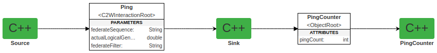

<!-- DO NOT MODIFY THIS FILE IN THE cpswt-cpp PROJECT.
IT WAS GENERATED IN THE cpswt-docs PROJECT.  TO MODIFY, ONLY MODIFY THE "README.rst" FILES
(WHICH ARE reStructuredText) IN THE <cpswt-docs>/DocsMain/ProjectDocs/cpswt-cpp DIRECTORY,
WHERE <cpswt-docs> IS THE TOP-LEVEL DIRECTORY OF THE cpswt-docs PROJECT.
THEN, IN A TERMINAL, CD TO THE <cpswt-docs>/DocsMain DIRECTORY AND EXECUTE
"./gradlew :ProjectDocs:cpswt-cpp:build".  ONCE THIS COMMAND FINISHES, CD TO THE TOP-LEVEL
cpswt-cpp DIRECTORY AND EXECUTE "unzip -oq <cpswt-docs>/DocsMain/ProjectDocs/cpswt-cpp/Zipfile/cpswt-cpp.zip" -->

# To Run the HelloWorldCpp Example

#### NOTE
Steps below assume that you have installed CPSWT on your computer as shown in
[CPSWT Software Installation and Instructions to Build and Publish cpswt-core Modules on Ubuntu 20.04 LTS (Focal Fossa)](https://github.com/SimIntToolkit/cpswt-core#cpswt-software-installation-and-instructions-to-build-and-publish-cpswt-core-modules-on-ubuntu-2004-lts-focal-fossa)
and [CPSWT Installation for HelloWorldCpp example on Ubuntu 20.04 LTS (Focal Fossa)](../../README.md#cpswtcppsoftwareinstallation).

#### NOTE
Steps below assume that you are already able to run the
[HelloWorldJava example](https://github.com/SimIntToolkit/cpswt-core/tree/develop/examples/HelloWorldJava)
from the [cpswt-core](https://github.com/SimIntToolkit/cpswt-core) repository

* Open a terminal and change directory to the HelloWorldCpp directory
  ```bash
  cd <cpswt-cpp>/examples/HelloWorldCpp
  ```

  where <cpswt-cpp> is the top-level directory of the cpswt-cpp project on your computer.
* For the first run only, enter the following command:
  ```bash
  gradle wrapper --gradle-version=8.0
  ```
* To run the federation, enter the following command:
  ```bash
  ./gradlew :runFederation
  ```

## Explanation of HelloWorld example

In its CPSWT model, the FOM of the HelloWorld example is shown in the figure below:



The Source federate published the Ping interaction and sends out an infinite sequence of them, printing a message for
each Ping it sends.

The Sink federate subscribes to the Ping interaction and, upon receipt, prints a message to this affect.  It also
publishes a PingCount object that has a single integer attribute pingCount.  It increments pingCount for each Ping
interaction it receives, while also printing the value of pingCount.

The PingCounter federate subscribes to the PingCount object and prints the value of its pingCount attribute
every time it changes.
